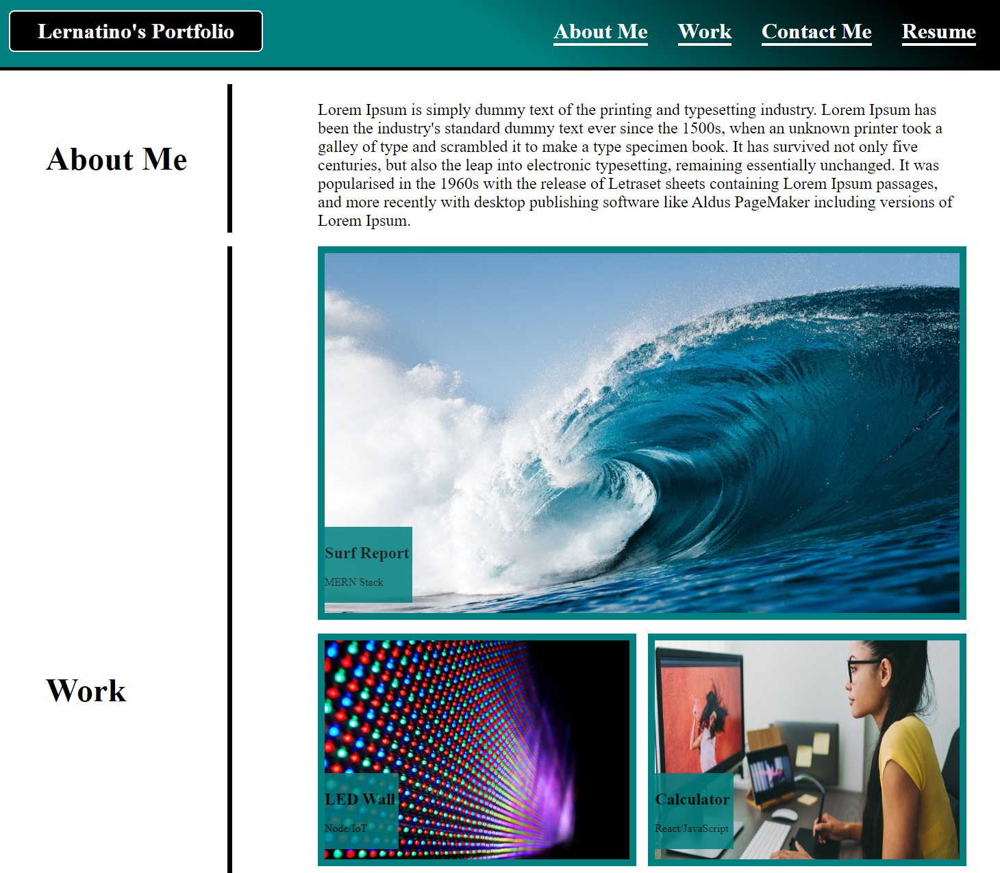

# Advanced-CSS-Homework
This project is a mock portfolio to demonstrate styling techniques using html and css.  The site features a header, including a title, and links taking you to various spots on the page.  following the header is a text area for the client to use to tell the reader a bit about themselves.  The template offers up to five locations to add images showing off previous work. Lastly, there is a contact footer offering links to the clients other media outlets.

## Screenshot Preview

### Deployed Link
https://colecarter9530.github.io/Advanced-CSS-Challenge/
### GitHub Repo Link
https://github.com/ColeCarter9530/Advanced-CSS-Challenge